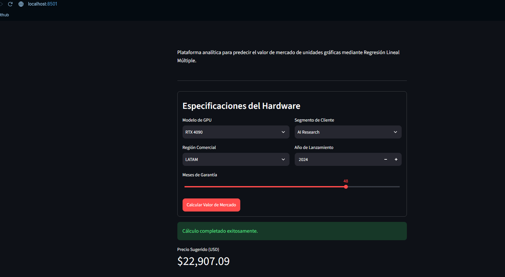

# Nvidia Precios de la GPU API

Plataforma Full-Stack de analítica y predicción de precios para hardware gráfico, basada en Regresión Lineal Múltiple.

##Este archivo de readme ha sido redactado con inteligencia artificial

##Arquitectura del Sistema
1. **Cloud Database:** PostgreSQL alojado en **Supabase** para persistencia de datos.
2. **Machine Learning Backend:** Motor predictivo entrenado con `scikit-learn` y expuesto vía **FastAPI** (`Pydantic` para validación estricta).
3. **Frontend Analytics:** Dashboard interactivo construido con **Streamlit** para visualización de métricas de negocio en tiempo real.
4. **DevOps:** Contenedorización completa mediante **Docker** para despliegues agnósticos al sistema operativo.
   

## Despliegue con un Clic (Docker)
Para auditar y ejecutar esta plataforma localmente sin configurar entornos de Python, asegúrate de tener Docker instalado y ejecuta:

1. Clona el repositorio:
   `git clone https://github.com/BrokenPeter16/Nvidia-gpu-ml.git`
2. Crea tu archivo `.env` en la raíz con la URI de tu base de datos:
   `SUPABASE_URI="tu_cadena_de_conexion"`
3. Levanta la arquitectura completa:
   `docker-compose up --build`

La Interfaz Gráfica estará disponible en `http://localhost:8501` y la documentación de la API en `http://localhost:8000/docs`.
